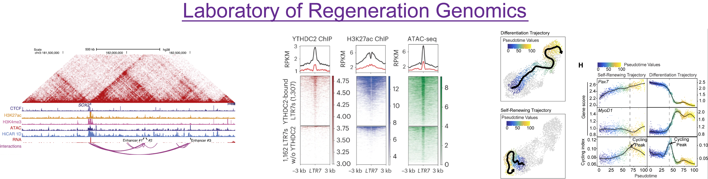

# Diao Lab Bioinformatics Repository
---------------------------------------------------------------------

### Lab Overview
As a functional genomics lab, we are developing genome profiling and engineering approaches to study how chromatin modification and structure impacts gene expression. As a cell biology lab, we study the gene regulatory mechanisms underlying cell fate control in development, regeneration, and human disease. 

Facilitating the integration of both of arms of research is bioinformatics or computational biology, which constitutes computational and analytical methods through which biological insights can be extracted from raw genomic data.
____________________________________________________________________

### The purpose of this repository
The purpose of this repository is to:
1. Serve as a hub for tracking, managing, and sharing lab code.
2. Help new lab entrants to learn bioinformatics.
3. Curate common bioinformatics pipelines used in the lab.

New lab entrants can start learning through this repository's wiki page. Common lab bioinformatics pipelines can be found [here](./pipelines), and links to publication-specific lab code can be found [here](./).

